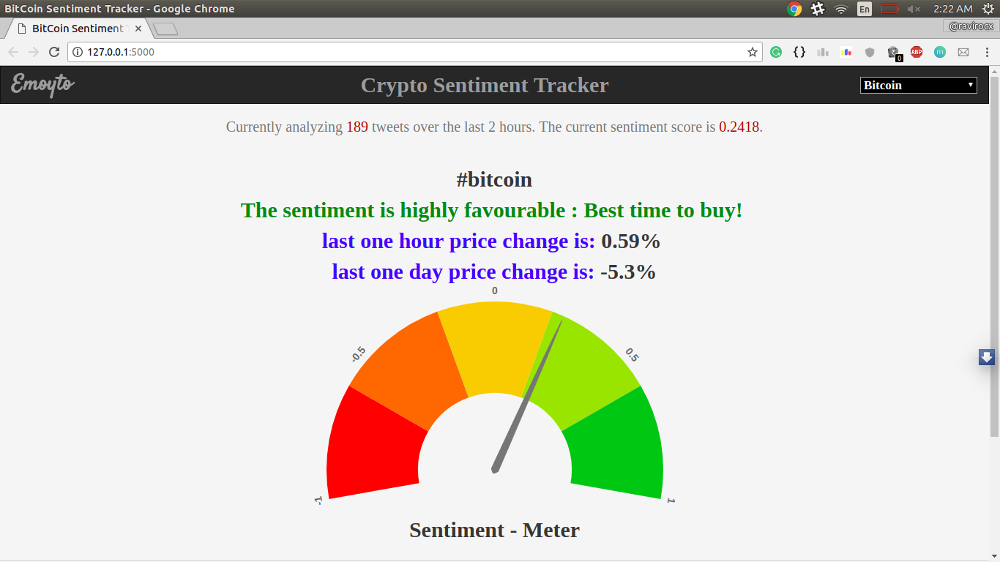
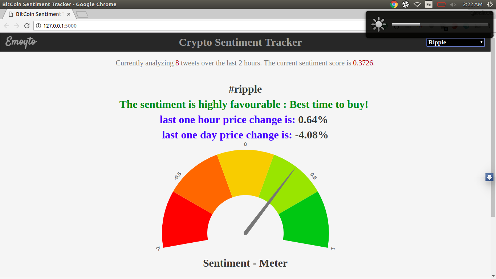

# Twitter-Text-Mining-and-Analysis-using-Tweepy

Text Mining application which takes Twitter as a source and mines all tweets related to Bitcoin. Then sentiment analysis is performed on them and the results obtained are plotted on a widget and displayed.

## Requirements: 
Flask

redis

Pandas

Tweepy

vaderSentiment

